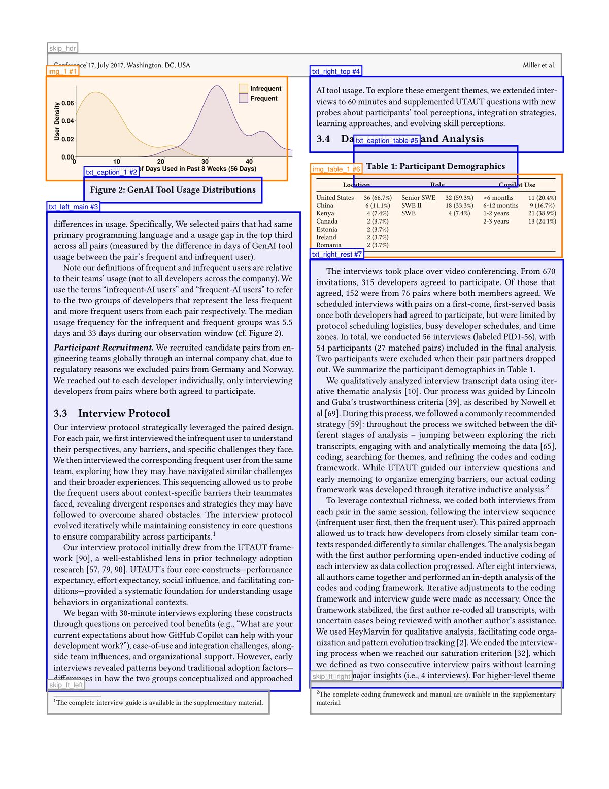
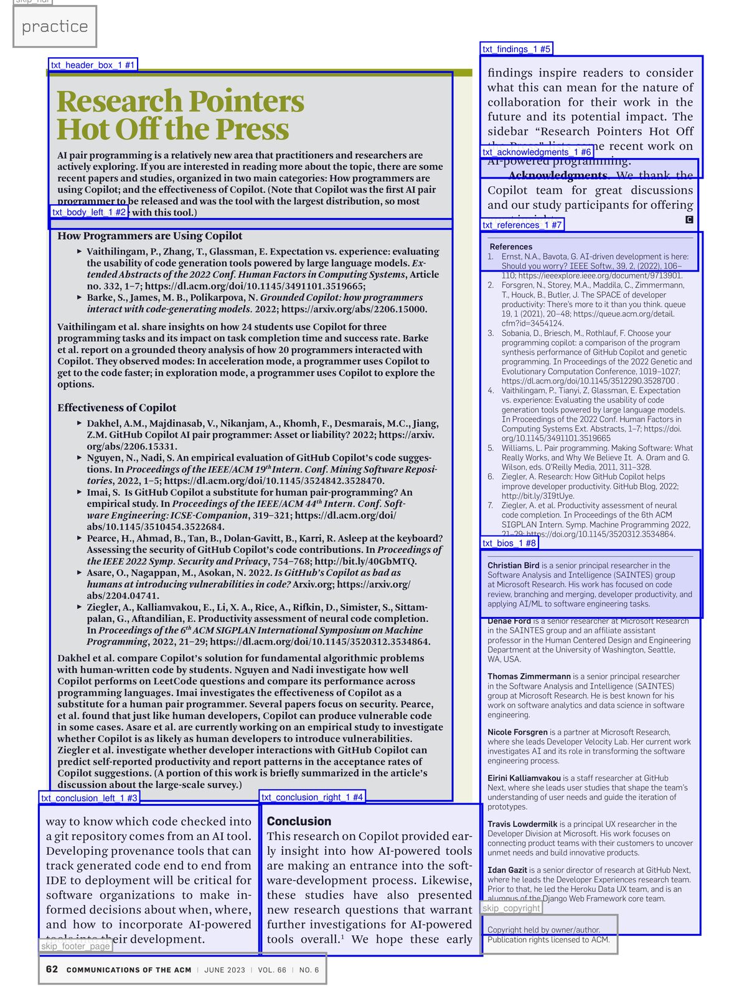

# PDF Extraction Pipeline

A vision-powered tool that converts PDF documents (especially academic papers) into clean, structured Markdown with extracted images. It uses an LLM with vision capabilities to understand page layouts, then combines programmatic text extraction with intelligent formatting.

<p align="center">
  
  &nbsp;&nbsp;
  
</p>
<p align="center">
  <em>Left: Figure, table, and text region detection in a two-column academic paper. Right: Fine-grained semantic regions — sidebar callout, references, author bios, and body text identified separately.</em>
</p>

## How It Works

Text and bounding boxes are extracted directly from the PDF. No OCR is involved. A vision model then looks at a rendered image of the page alongside this extracted information to understand the layout.

The pipeline processes each page through four stages:

1. **Render & Analyze** — Renders the page to a 300 DPI PNG and extracts raw text blocks with their bounding box coordinates directly from the PDF using PyMuPDF. This is the ground truth text, pulled straight from the PDF's internal data.
2. **Layout Detection** (LLM call) — A vision model receives the page image and the extracted text blocks with their positions. By *looking* at the page, it determines what each region is (body text, figure, table, sidebar), what should be skipped (headers, footers, page numbers), and what order everything should be read in. It outputs a layout JSON with semantic regions and reading order.
3. **Content Extraction** — Text regions are extracted via pdfplumber using the detected bounding boxes; image regions are cropped as high-res PNGs from the original PDF.
4. **Markdown Assembly** (LLM call) — The vision model sees an annotated version of the page (with labeled bounding boxes) alongside the extracted text, then formats it into clean Markdown with appropriate headings, lists, blockquotes, and inline image references.

Optionally, a post-pass describes all extracted images, and an additional stage attempts to convert detected tables into Markdown.

## Quick Start

The script uses [PEP 723](https://peps.python.org/pep-0723/) inline metadata, so [uv](https://docs.astral.sh/uv/) handles dependencies automatically:

```bash
# Set your OpenAI API key
export OPENAI_API_KEY=sk-...

# Extract a PDF
uv run extract.py paper.pdf
```

This creates a directory (named after the PDF) containing Markdown, layout JSON, annotated box images, and any extracted figures.

### Requirements

- Python 3.11+
- [uv](https://docs.astral.sh/uv/) (recommended) or manually install: `pymupdf`, `pdfplumber`, `openai`, `python-dotenv`, `rich`
- An OpenAI API key (uses `gpt-5-mini` by default), or an Azure OpenAI endpoint

## Usage

```
uv run extract.py <pdf> [options]
```

| Option | Description |
|--------|-------------|
| `--pages 1,3,7` | Extract only specific pages (default: all) |
| `-o, --output-dir DIR` | Output directory (default: slugified PDF name) |
| `-j, --parallel N` | Parallel workers (default: 5, or `full` for one per page) |
| `--tables` | Attempt to extract tables as Markdown instead of images |
| `--no-describe` | Skip the image description post-pass |
| `--describe-only` | Only generate image descriptions from an existing output directory |
| `--azure` | Use Azure OpenAI endpoint (see below) |
| `--env-file PATH` | Path to .env file with API credentials (default: `~/.env`) |

### Examples

```bash
# Extract pages 3 and 7, with table extraction
uv run extract.py paper.pdf --pages 3,7 --tables

# Extract with 8 parallel workers, output to a specific directory
uv run extract.py paper.pdf -j 8 -o results/

# Generate image descriptions for a previous extraction
uv run extract.py paper.pdf --describe-only -o results/

# Use Azure OpenAI instead of OpenAI
uv run extract.py paper.pdf --azure --env-file ~/aoai.env
```

### Azure OpenAI

To use an Azure OpenAI endpoint instead of the standard OpenAI API, pass `--azure` and provide credentials via environment variables or a `.env` file:

| Variable | Required | Description |
|----------|----------|-------------|
| `AZURE_OPENAI_API_KEY` | Yes | Your Azure OpenAI API key |
| `AZURE_OPENAI_ENDPOINT` | Yes | Endpoint URL (e.g., `https://my-resource.openai.azure.com/`) |
| `AZURE_OPENAI_API_VERSION` | No | API version (default: `2025-04-01-preview`) |

## Output

For a multi-page PDF, the output directory looks like:

```
output/
├── combined.md              # All pages merged with --- separators
├── combined_accessible.md   # Version with image descriptions inline
├── combined_text_only.md    # No image references
├── image_descriptions.json  # Titles and descriptions for all images
├── page1.md                 # Per-page Markdown
├── page1_layout.json        # Detected regions and reading order
├── page1_boxes.png          # Annotated page showing detected regions
├── page1_img_1.png          # Extracted figure/chart
├── page2.md
├── page2_layout.json
├── page2_boxes.png
└── ...
```

### Layout JSON

Each page produces a layout file describing the detected regions:

```json
{
  "page": 3,
  "regions": [
    {"id": "txt_title",   "type": "text",  "bbox": [0.06, 0.07, 0.61, 0.23]},
    {"id": "img_table_1", "type": "image", "bbox": [0.06, 0.28, 0.61, 0.52], "image_kind": "table"},
    {"id": "txt_body",    "type": "text",  "bbox": [0.06, 0.56, 0.61, 0.80]},
    {"id": "skip_footer", "type": "skip",  "bbox": [0.05, 0.95, 0.44, 0.98]}
  ],
  "reading_order": ["txt_title", "img_table_1", "txt_body"]
}
```

Bounding boxes use normalized coordinates `[x0, y0, x1, y1]` where `(0,0)` is the top-left and `(1,1)` is the bottom-right of the page.

## Table Extraction

With `--tables`, the pipeline attempts to convert detected tables into Markdown:

1. **Classification** — The layout detection LLM tags image regions as `"table"` or `"figure"`
2. **pdfplumber extraction** — Tables are first extracted programmatically using pdfplumber with quality scoring (requires 2+ rows/columns, <35% empty cells, no ragged rows)
3. **LLM fallback** — Tables that fail quality checks are sent to the vision model, which converts the cropped table image to a Markdown table
4. **Assembly** — Successfully extracted Markdown tables are placed inline; complex tables that resist conversion remain as images

## Region Types

The layout detection identifies three region types:

| Type | Description | Handling |
|------|-------------|----------|
| `text` | Body text, headings, captions, sidebars, references | Extracted as text via pdfplumber |
| `image` | Figures, charts, diagrams, photos, complex tables | Cropped as PNG images |
| `skip` | Headers, footers, page numbers, copyright notices, DOI lines, journal boilerplate | Ignored |

The detection prompt guides the LLM to create **semantic regions, not geometric columns** — a single column containing a sidebar callout, body text, and a references section will be split into separate regions at visual boundaries (background color changes, borders, content-type shifts).

## Output Variants

For multi-page PDFs, the pipeline produces three versions of the combined Markdown:

| File | Description |
|------|-------------|
| `combined.md` | Standard Markdown with `` image references |
| `combined_accessible.md` | Images kept inline with detailed descriptions added as blockquotes below each one |
| `combined_text_only.md` | Image references replaced with text descriptions, no image links. Ideal for feeding to LLMs that don't support vision. |

The accessible and text-only variants are generated automatically from the image descriptions post-pass (disable with `--no-describe`).

## Cost

The pipeline uses `gpt-5-mini`, which keeps costs low. A typical 7-10 page academic paper costs **$0.10 to $0.25**. Disabling image descriptions with `--no-describe` makes it even cheaper.

## License

MIT
